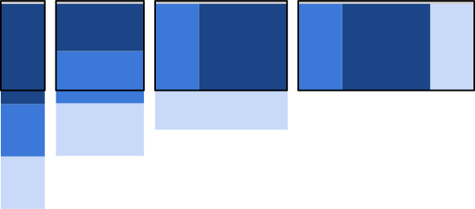

# front-end-hacks
## Tools
- chrome developer tools
- [visual studio code](https://code.visualstudio.com/)
- [Udacity Feedback Chrome Extension](https://github.com/udacity/frontend-grading-engine)

## Web Mobile First Concepts
- Viewport size - Defines the area of the screen that the browser render content too.
- Device Pixel Ratio - is the ratio between physical pixels and logical pixels.
- DIP: Devices independent pixels = Hardware Pixels * (1 css pixel/DPR)
- User Agent - This is a technical data about the device and software that the visitor is using.

## Responsive Tricks

- Always set viewport!

```html
<meta name="viewport" content="width=device-width,initial-scale=1.0">
```
- Always set the max-width for tags: img, embed, object, video
```css
img, embed, object, video {
    max-width: 100%;
}
```
- the minimun width of the devices is 320px, less than its is responsive
- Tap targets should be have 48px for height and 48px for width, for do more easily touch them, FI.:
```css
nav a, button {
    min-width: 48px;
    min-height: 48px;
}
```
- Apply first mobile, start development with the smallest screen and end with the largest screen, this is a good practice and help to improve in performance

## Media queries
- Media quieres are your friend!
- Add media queries:

1. First option. use media attribute into html (many small files and many http requests)

```html
<link rel="stylesheet" media="screen and (min-width:320px)" href="mobile.css">
<link rel="stylesheet" media="screen and (min-width:768px)" href="tablet.css">
<link rel="stylesheet" media="screen and (min-width:1024px)" href="desktop.css">
```

2. Use @media into css code (big files and few http requests)
```css

@media screen and (min-width:320px) {
    // mobile
}
@media screen and (min-width:768px) {
    // tablet
}
@media screen and (min-width:1024px) {
    // desktop
}
```

3. use @import (not recommendded for performance)

```css
@import url("mobile.css") only screen and (min-width:320px);
```

- Use <code>max-width</code> and <code>min-width</code> instead of <code>max-device-width</code> and <code>min-device-width</code> in media queries
- Pick breakpoints for media queries acordding to the content of application
- We can apply complex media queries like this:

```css
@media only screen and (min-width:500px) and (max-width:600px) {
    // css content
}
```

## Flexbox
- Flexbox is one of the most powerfull tools for the layout
```html
<!-- styles -->
<style>
.container {
    width:100%;
    display: flex;
}
.box {
    width: 150px;
}
</style>
<!-- html -->
<div class="container">
    <div class="box dark_blue"></div>
    <div class="box light_blue"></div>
    <div class="box green"></div>
</div>
```

-   Use <code>flex-wrap: wrap</code> in the <code>.container</code> style for wrap the content to the next line
- Use <code>order</code> style in the container's child for apply order for the elements FI: <code>order: 1</code>
- Use width on percentage

## Responsive Patterns

### Mostly Fliud


```html
<style type="text/css">
    .container {
        display:flex;
        flex-wrap: wrap;
    }
    .box {
        width:100%;
    }
    @media screen and (min-width: 450px) {
        .light-blue, .green {
            width:50%;
        }
    }
    @media screen and (min-width: 550px) {
        .dark-blue, .light-blue {
            width:50%;
        }
        .green, .red, .orange {
            width:33.333333%;
        }
    }
    @media screen and (min-width: 700px) {
        .container {
            width:700px;
            margin-left: auto;
            margin-right: auto;
        }
    }
</style>
<div class="container">
    <div class="box dark_blue"></div>
    <div class="box light_blue"></div>
    <div class="box green"></div>
    <div class="box red"></div>
    <div class="box orange"></div>
</div>
```

### Layout Shifter


```html
<style type="text/css">
    .container {
        width: 100%;
        display:flex;
        flex-wrap: wrap;
    }
    .box {
        width:100%;
    }
    @media screen and (min-width: 500px) {
        .dark-blue {
            width:50%;
        }
        #container2 {
            width:50%;
        }
    }
    @media screen and (min-width: 600px) {
        .dark-blue {
            width:25%;
            order: 1;
        }
        #container2 {
            width:50px;
        }
        .red {
            width:25%;
            order: -1;
        }
    }
    @media screen and (min-width: 700px) {
        .container {
            width:700px;
            margin-left: auto;
            margin-right: auto;
        }
    }
</style>
<div class="container">
    <div class="box dark_blue"></div>
    <div class="container" id="container2">
        <div class="box light_blue"></div>
        <div class="box green"></div>
    </div>
    <div class="box red"></div>
</div>
```

### Column Drop



```html
<style type="text/css">
    .container {
        display:flex;
        flex-wrap: wrap;
    }
    .box {
        width:100%;
    }
    @media screen and (min-width: 450px) {
        .dark-blue {
            width:25%;
        }
        .light-blue {
            width:75%;
        }
    }
    @media screen and (min-width: 550px) {
        .dark-blue, .green {
            width:25%;
        }
        .light-blue {
            width:50%;
        }
    }
</style>
<div class="container">
    <div class="box dark_blue"></div>
    <div class="box light_blue"></div>
    <div class="box green"></div>
</div>
```

### Off Canvas


```html
<style type="text/css">
    html, body, main {
        height: 100%;
        width: 100%;
    }
    nav {
        width: 300px;
        height: 100%;
        position: absolute;
        transform: translate(-300px, 0);
        transition: transform 0.3 ease;
    }
    nav.open {
        transform: translate(0, 0);
    }

    @media screen and (min-width: 600px) {
        nav {
            position: relative;
            transform: translate(0, 0);
        }
        body {
            display: flex;
            flex-flow: row nowrap;
        }
        main {
            width: auto;
            flex-grow: 1;
        }
    }
</style>
<nav id="drawer" class="dark-blue"></nav>
<main class="light-blue"></main>
<script>
    menu.addEventListener('click', function (e) {
        drawer.classList.toogle('open');
        e.stopPropagation();
    })
</script>
```

## Responsive tables

### Hidden Columns

```html
<style type="text/css">
    .longName, .inning {
        display: none;
    }
</style>
<table>
    <tr>
        <td>
            <span class="shortName">TOR</span>
            <span class="longName">Toronto Blue Jays</span>
        </td>
        <td class="inning">0</td>
        <td class="inning">0</td>
        <td class="inning">0</td>
        <td class="inning">0</td>
        <td class="inning">0</td>
        <td class="inning">0</td>
        <td class="inning">4</td>
        <td class="inning">0</td>
        <td class="inning">1</td>
        <td class="inning">0</td>
        <td class="inning">0</td>
        <td class="inning">0</td>
        <td class="final">5</td>        
    </tr>
</table>
```

### No More Tables

```html
<style type="text/css">
    @media screen and (max-width:500px) {
        table, thead, tbody, th, td, tr {
            display: block;
        }
        thead tr {
            position: absolute;
            top: -9999px;
            left: -9999px;
        }
        td {
            position: relative;
            padding-left: 50%;
        }
        td:before {
            position: absolute;
            left: 6px;
            content: attr(data-th);
            font-weight: bold;
        }
    }
</style>
<table>
    <!-- some content of the table -->
    <tr>
        <td data-th="Team">Toronto</td>
        <td data-th="1st">0</td>
        <td data-th="2nd">0</td>
        <td data-th="3rd">0</td>
        <td data-th="4th">0</td>
        <td data-th="5th">0</td>
        <td data-th="6th">0</td>
        <td data-th="7th">4</td>
        <td data-th="8th">0</td>
        <td data-th="9th">1</td>
        <td data-th="Final">5</td>      
    </tr>
</table>
```

### Contained scrolling

```html
<style>
    div.container-table {
        width: 100%;
        overflow-x: auto;
    }
</style>
<div class="container-table">
    <table>
    <!-- table content -->
    </table>
</div>
```

## Fonts
- Measure: the length of a line of text, use measures as a factor for picking breackpoints
- Ideal Measure: 45 - 90 characters per line (65cpl is recommended)
- base font: .goodFonts {font-size: 16px; line-height: 1.2em;}
- biggerFonts { font-size: 18px;line-hieght: 1.25em;}
- smallFonts { font-size: 14px; line-height: 1.2em;}